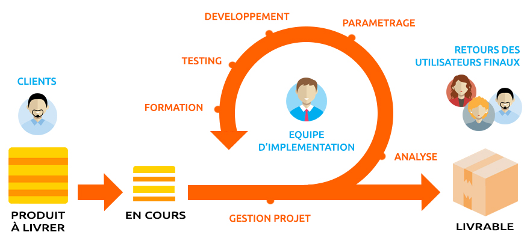
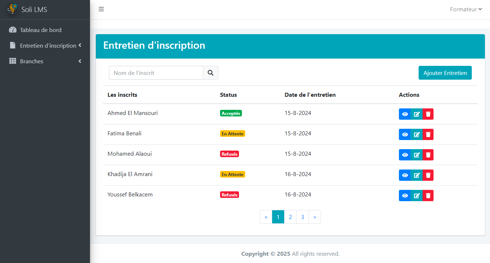
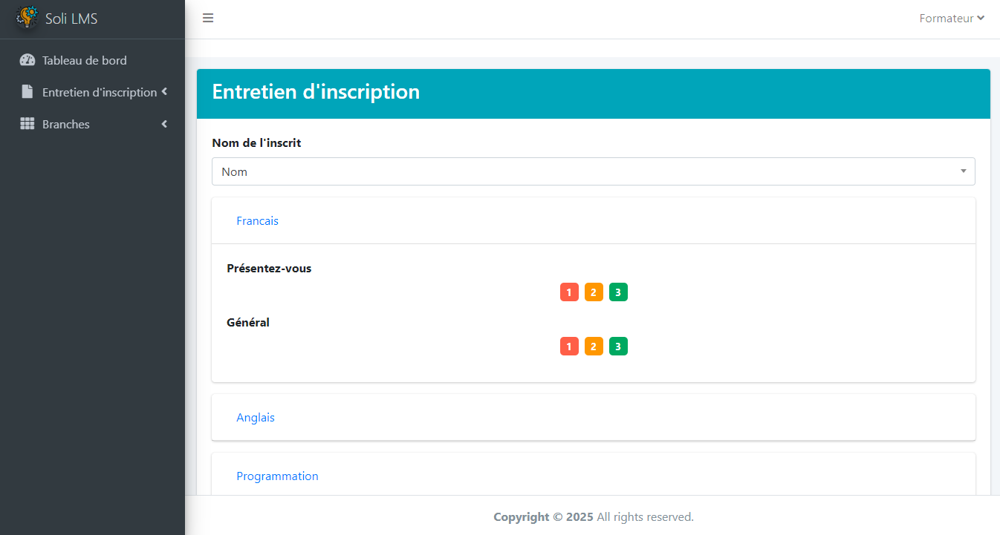
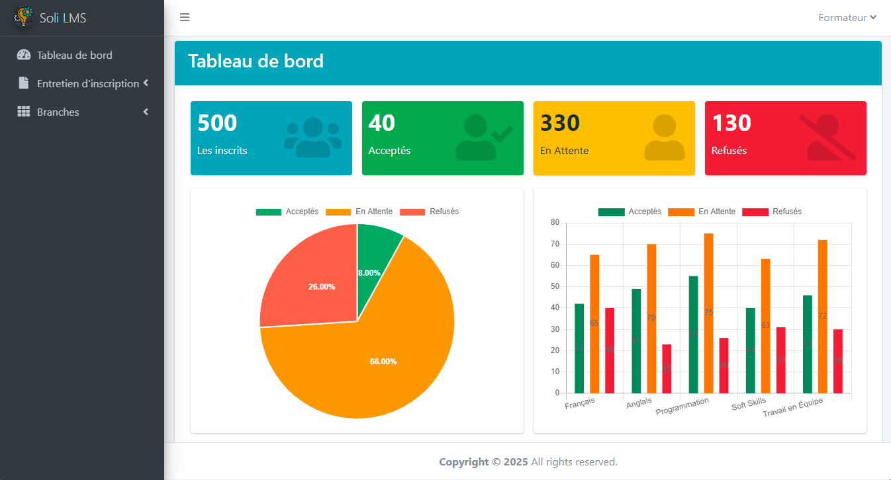

    
    

## **Entretien d'inscription**

### **Projet Fil Rouge**

- Présenté par: SUIRITA Fahd
- Encadré par: ESSARRAJ Fouad

---

### **1. Introduction:**

---

#### **2. Cahier des charges:**

---

### **3. Methode de travail:**

- 3.1. Méthode Agile
- 3.2. 2TUP
- 3.3. UX design

|||

#### **3.1. Méthode Agile:**

|||

#### **3.2. 2TUP:**

|||

#### **3.3. UX design:**

---

### **4. Planification:**

|||

#### **4.1. GitHub Project:**

|||

#### **4.2. Diagramme de Gantt:**

---

### **5. Branche technique:**

- 5.1. Capture de besoins techniques
- 5.2. Analyse technique
- 5.3. Auto-formation
- 5.4. Conception generique

|||

#### **5.1. Capture de besoins techniques:**

- UI UX
- Frontend
- Backend
- Base de données
- Deployment

|||

#### **5.2. Analyse technique:**

- ✔ MySQL 
- ✔ One Page 
- ✔ Seeders 
- ✔ Test 
- ✔ Filter 
- ✔ Pagination 
- ✔ Module Laravel 
- ✔ i18n 
- ✔ Request class 
- ✔ Securite 
- ✔ Import / Export 

|||

#### **5.3. Auto-formation:**

- Composant UI

|||

#### **5.4. Conception generique:**

---

### **6. Branche fonctionnelle:**

- 6.1. Carte d’empathie
- 6.2. Définir le problème
- 6.3. Idéation
- 6.4. Diagramme de cas d’utilisation sprint 1
- 6.5. Diagramme de cas d’utilisation sprint 2

|||

#### **6.1. Carte d’empathie de l’inscrits:**

|||

#### **6.1. Carte d’empathie de formateur:**

|||

#### **6.1. Card d’empathie de responsable de formation:**

|||

#### **6.2. Définir le problème:**

il existe de nombreuses applications dispersées avec des technologies différentes, ce qui rend leur maintenance difficile

|||

#### **6.3. Idéation (cas d’utilisation):**

|||

#### **6.4. Diagramme de cas d’utilisation sprint 1:**

|||

#### **6.5. Diagramme de cas d’utilisation sprint 2:**

---

### **7. Conception:**

- 7.1. Diagramme de class
- 7.2. Maquette 1
- 7.3. Maquette 2
- 7.4. Maquette 3

|||

#### **7.1. Diagramme de class:**

|||

#### **7.2. Maquette 1:**

|||

#### **7.3. Maquette 2:**

|||

#### **7.4. Maquette 3:**

---

### **8. Réalisation:**

---

### **9. Conclusion:**
