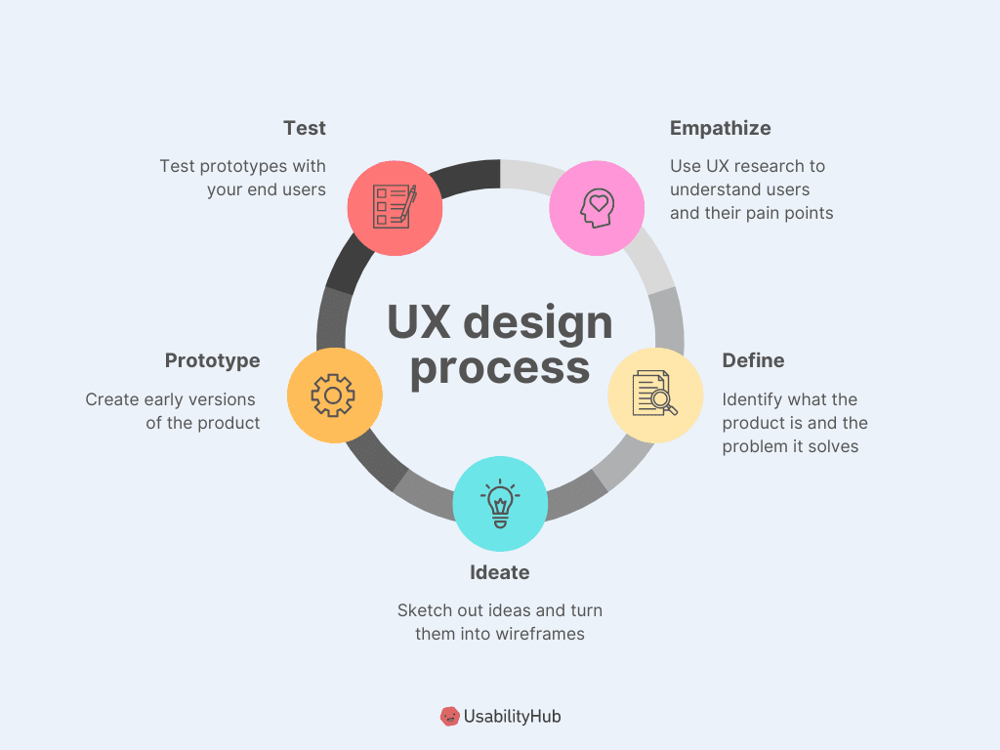
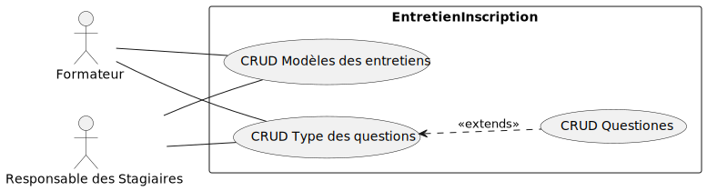

    
    

## **Entretien d'inscription**

### **Projet Fil Rouge**

- Présenté par: SUIRITA Fahd
- Encadré par: ESSARRAJ Fouad

---

### **1. Introduction:**

---

#### **2. Cahier des charges:**

---

### **3. Methode de travail:**

- 3.1. Méthode Agile
- 3.2. 2TUP
- 3.3. UX design
- 3.4. Gestion des tâches

|||

#### **3.1. Méthode Agile:**

|||

#### **3.2. 2TUP:**

|||

#### **3.3. UX design:**

|||

#### **3.4. Gestion des tâches:**

---

### **4. Diagramme de cas d’utilisation:**

- 4.1. Diagramme de cas d’utilisation general
- 4.2. Diagramme de cas d’utilisation sprint 1
- 4.3. Diagramme de cas d’utilisation sprint 2
- 4.4. Diagramme de cas d’utilisation sprint 3

|||

#### **4.1. Diagramme de cas d’utilisation general:**

|||

#### **4.2. Diagramme de cas d’utilisation sprint 1:**

|||

#### **4.3. Diagramme de cas d’utilisation sprint 2:**

|||

#### **4.4. Diagramme de cas d’utilisation sprint 3:**

---

### **5. Conception:**

- 5.1. Diagramme de class
- 5.2. Maquette 1
- 5.3. Maquette 2
- 5.4. Maquette 3

|||

#### **5.1. Diagramme de class:**

|||

#### **5.2. Maquette 1:**

|||

#### **5.3. Maquette 2:**

|||

#### **5.4. Maquette 3:**

---

### **6. Réalisation:**

- 6.1. Technologiques utilisées
- 6.2. Sprint 1
- 6.3. Sprint 2
- 6.4. Sprint 3

|||

#### **6.1. Technologiques utilisées:**

|||

#### **6.2. Sprint 1:**

|||

#### **6.3. Sprint 2:**

|||

|||

#### **6.4. Sprint 3:**

---

### **7. Conclusion:**
