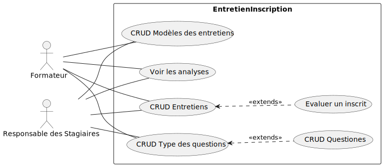
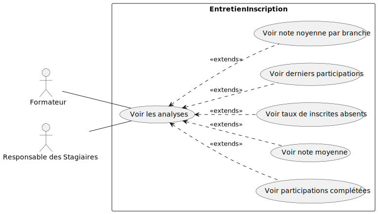

# Branche fonctionnelle

## Carte d’empathie

- Ce qu’il dit :
  - « J’ai besoin de comparer facilement les scores entre les étudiants. »
  - « J’aimerais avoir plus de temps avec chaque étudiant. »
- Ce qu’il fait :
  - Prennent des notes rapides pendant les entretiens.
  - Cherchent des schémas ou des tendances dans les réponses des étudiants.
- Ce qu’il entend :
  - « Le système devrait nous faire gagner du temps. »
  - « Assurez-vous de couvrir tous les critères. »
- Ce qu’il voit :
  - Débordé par des entretiens successifs.
  - Inquiétude quant à l'équité et à l'exactitude de la notation.

## Définir le problème

il existe de nombreuses applications dispersées avec des technologies différentes, ce qui rend leur maintenance difficile

## Idéation

Création d'un système permettant de faciliter entretiens d'inscription des étudiants.

## Diagramme de cas d’utilisation sprint 1

## Diagramme de cas d’utilisation sprint 2

