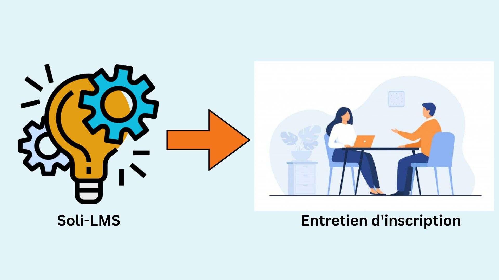

# Contexte du projet

SOLI-LMS est une plateforme de gestion de formation puissante et polyvalente conçue pour répondre aux besoins des organismes de formation et des établissements d'enseignement.
